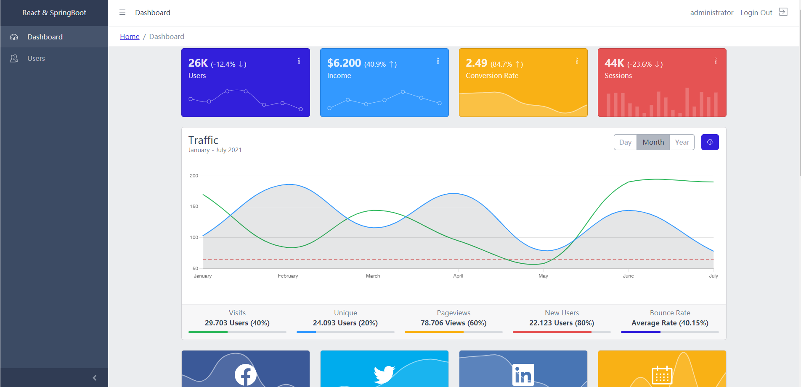
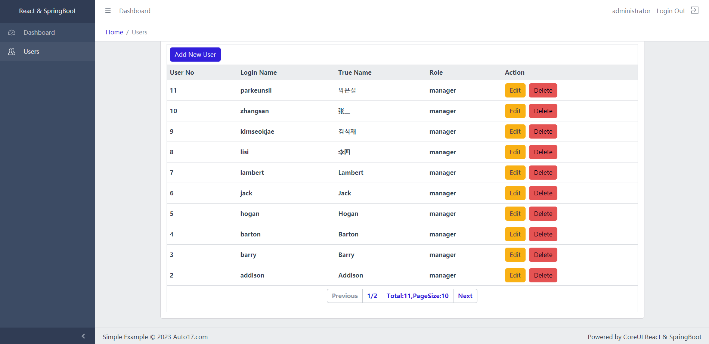

# A Simple Example Of React & SpringBoot

This project was built with React & SpringBoot. The project uses a development framework that separates the front-end and back-end, uses different project file paths, and physically isolates the source code of the front-end and back-end. The front-end uses React, the back-end uses SpringBoot microservice, and the database uses MySQL. The front-end and back-end are separate source code projects. The front-end directory is "ReactSpringBootClient", the back-end directory is "ReactSpringBootServer", and the database creation script is in the directory "MySQL".\
The backend SpringBoot microservice uses port 8080 by default, which can be modified according to your own situation. The file location of the front-end configuration server is "/ReactSpringBoot/ReactSpringBootClient/src/tool/http-common.js", and the variable name is "baseURL".\
The front-end UI uses the free template of CoreUI. This project can be used as an example for beginners to learn, and also as an initial project for WEB system development. The project uses the MIT protocol without any restrictions and can be used commercially.

## Technology Stack
Front-end: NodeJs 18.0.0, React 18.2.0, CoreUI 4.3.1\
Front-end development tool: WebStorm 2019\
Back-end: Java 1.8, Spring Boot, JWT, Mybatis, Maven\
Back-end development tool: IntelliJ IDEA 2019\
Database: MySQL 5.7+

## ScreenShot

# React和SpringBoot的简单示例
本项目使用React和SpringBoot微服务实现一个简单、完整的WEB系统。项目采用前、后端分离的开发框架，使用不同的工程文件路径，前、后端的源代码物理隔绝。前端使用React，后端使用SpringBoot微服务，数据库使用MySQL。前、后端是分别单独的工程文件。前端目录是ReactSpringBootClient，后端目录是ReactSpringBootServer，建库脚本在目录MySQL中。\
后端SpringBoot微服务默认使用8080端口，可根据自己情况进行修改。前端配置服务端的文件位置“/ReactSpringBoot/ReactSpringBootClient/src/tool/http-common.js”，变量名称“baseURL”。\
前端UI使用CoreUI的免费模板。CoreUI不太符合国人的审美观，可以自行替换。本项目可作为初学者的入门学习例子，也可作为WEB系统开发的初始工程。采用MIT协议，没有任何限制，可以商用。

## 技术栈
前端：NodeJs 18.0.0, React 18.2.0, CoreUI 4.3.1 \
前端开发工具: WebStorm 2019\
后端：Java 1.8, Spring Boot, JWT, Mybatis, Maven \
后端开发工具: IntelliJ IDEA 2019\
数据库: MySQL 5.7+

# React 및 SpringBoot의 간단한 예
이 프로젝트는 React&SpringBoot로 구축되었습니다.이 프로젝트는 프런트엔드와 백엔드를 분리하고 서로 다른 프로젝트 파일 경로를 사용하며 프런트엔드와 백엔드의 소스 코드를 물리적으로 격리하는 개발 프레임워크를 사용합니다.프런트엔드는 React, 백엔드는 SpringBoot 마이크로서비스, 데이터베이스는 MySQL을 사용합니다.프런트엔드와 백엔드는 별도의 소스 코드 프로젝트입니다.프런트엔드 디렉토리는 "ReactSpringBootClient", 백엔드 디렉토리는 "ReactSpringBootServer", 데이터베이스 생성 스크립트는 "MySQL" 디렉토리에 \
백엔드 SpringBoot 마이크로 서비스는 기본적으로 포트 8080을 사용하며 상황에 따라 수정할 수 있습니다.프런트엔드 구성 서버의 파일 위치는 "/ReactSpringBoot/RactSpringBootClient/src/tool/httpcommon.js", 변수 이름은 "baseURL"\
프런트엔드 UI는 CoreUI의 무료 템플릿을 사용합니다.이 프로젝트는 초보자 학습의 예제 또는 WEB 시스템 개발의 초기 프로젝트로 사용할 수 있습니다.이 프로젝트는 MIT 프로토콜을 사용하며 아무런 제한 없이 상업적으로 사용할 수 있다.

## 기술 창고
프런트엔드: NodeJs 18.0.0, React 18.2.0, CoreUI 4.3.1\
프런트엔드 개발 도구: WebStorm 2019\
백엔드: Java 1.8, Spring Boot, JWT, Mybatis, Maven\
백엔드 개발 도구: IntelliJ IDEA 2019\
데이터베이스: MySQL 5.7+